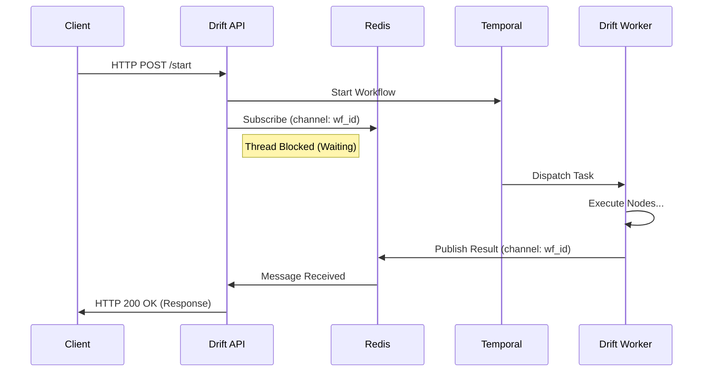
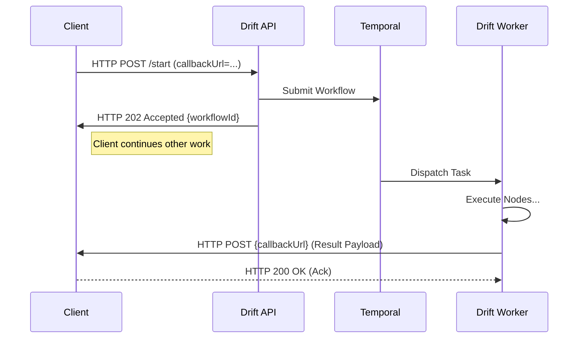

# Interaction Modes

Drift supports two primary interaction modes for clients: **Synchronous (Sync)** and **Asynchronous (Async)**. This flexibility allows clients to choose the integration pattern that best fits their user experience and technical constraints.

## 1. Synchronous Mode (Sync)

In Synchronous mode, the client makes an API call and waits for the workflow to execute and return a result. This is the default mode for user-interactive sessions where immediate feedback (e.g., the next screen or a success message) is required.

### Mechanism: Redis Pub/Sub Bridge
Since the underlying workflow engine (Temporal) is inherently asynchronous, Drift uses a **Redis Pub/Sub** bridge to simulate synchronous behavior.

1.  **Client Request**: Client calls `POST /workflow/start` (or `resume` / `execute-node`).
2.  **Subscribe**: The Drift API Service submits the job to Temporal and immediately **subscribes** to a specific Redis channel (e.g., `async_await_{workflowId}`). It blocks the HTTP response thread, waiting for a signal.
3.  **Execution**: The Drift Worker picks up the task from Temporal and executes the workflow logic.
4.  **Publish**: Upon reaching a stable state (e.g., waiting for user input or completion), the Worker **publishes** the result (View/Response) to the Redis channel.
5.  **Response**: The API Service receives the message, unblocks the thread, and returns the standard HTTP 200 response to the client.

### Diagram

### Use Cases
*   **Interactive UIs**: Powering a frontend where the user clicks "Next" and expects the next screen.
*   **Real-time Validations**: "Verify Bank Account" where the user waits for a success/failure confirmation.

---

## 2. Asynchronous Mode (Async)

In Asynchronous mode, the client initiates a workflow but does not wait for the execution to finish. The Drift API acknowledges the request immediately, and the result is delivered later via a callback (Webhook).

### Mechanism: Callback / Webhook
1.  **Client Request**: Client calls the API with a callback URL (or registers a default callback).
2.  **Submission**: The Drift API submits the job to Temporal and immediately returns `HTTP 202 Accepted` (or `200 OK` with just the `workflowId`). The connection is closed.
3.  **Background Execution**: The Worker executes the workflow independently of the client's connection.
4.  **Callback Trigger**: Once the workflow completes or reaches a specific milestone, the Worker (or a dedicated notification activity) triggers an HTTP POST to the client's callback URL with the payload.

### Diagram

### Use Cases
*   **Long-running processes**: Workflows taking minutes or hours (e.g., "Generate Monthly Report").
*   **System-to-System Integration**: Where the caller cannot hold an open connection (e.g., batch processing).
*   **High-Latency Operations**: Tasks involving third-party dependencies that might be slow or rate-limited.

## Summary Comparison

| Feature | Synchronous Mode | Asynchronous Mode |
| :--- | :--- | :--- |
| **Response Time** | Immediate (Waits for execution) | Instant Ack (Execution happens later) |
| **Client State** | Blocked / Waiting | Non-blocking |
| **Mechanism** | Redis Pub/Sub Bridge | HTTP Callback / Webhook |
| **Best For** | UI Interactions, Real-time Apps | Long-running Jobs, Batch Processing |
