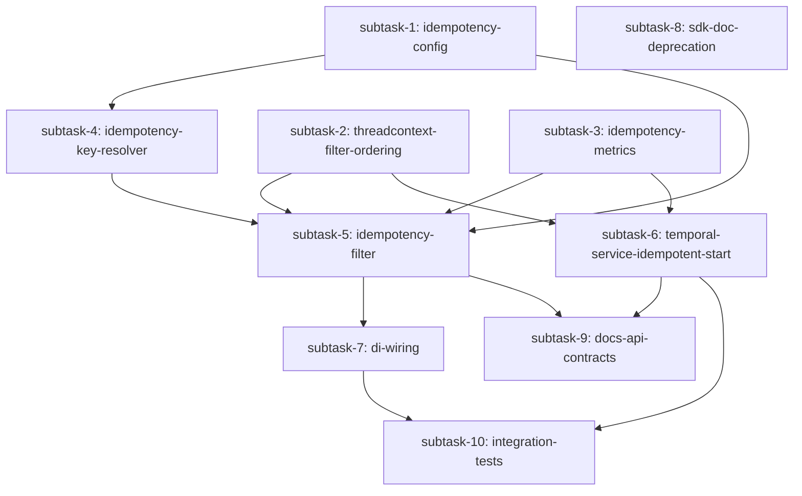

# Execution Plan: Business-Key Idempotency for Drift

**Feature tag:** `business-key-idempotency`
**Created:** 2026-08-03
**Status:** IN PROGRESS
**Planner version:** 1.0
**Design input:** `harness-docs/design/active/business-key-idempotency-lld.md` (local cache of Confluence page 474316866, v2, fetched 2026-08-03). PRD/HLD context is embedded in LLD §1-2; `designer.md`/`hld.md` intentionally skipped per `harness-state.md`.

## Requirement Summary

Today Drift's idempotency key for a workflow run is Temporal's `workflowId`, which is either caller-supplied (legacy, back-compat) or randomly generated — so client retries create duplicate executions, and a repeated explicit `workflowId` *terminates and replaces* the running workflow (data-lossy). This feature lets callers supply a **business-key** idempotency header on `POST /v3/workflow/start`; Drift deterministically derives the Temporal `workflowId` from `sha256(tenant:clientId:rawKey)` and relies on Temporal's atomic `StartWorkflowExecution` (reuse policy `ALLOW_DUPLICATE_FAILED_ONLY`) to guarantee at-most-one execution per business key, per tenant+client. Only `POST /v3/workflow/start` is affected; `worker`, `commons`, and `java-sdk` are unaffected except an optional doc-only deprecation note.

## ⚠️ Open Decision — Surfaced, Not Silently Resolved

LLD §14.1 explicitly leaves open **which variant to ship**:

| | §3.2 (Redis-backed) | §3.4 (Redis-free) — **LLD's own recommendation** |
|---|---|---|
| Extra components | `IdempotencyStore`, `RedisIdempotencyStore`, Redis-specific meters, new `WorkflowClientModule` bindings, response-side filter | None — request filter only |
| Concurrent dup handling | Client-side Redis `SETNX` + `409 IDEMPOTENCY_KEY_IN_FLIGHT` | Server-side, arbitrated by Temporal itself — no custom locking |
| Cache hit fast path | Yes (Redis `GET`) | No — every duplicate costs one `DescribeWorkflowExecution` (ms-scale) |
| Replay window | Configurable TTL (default 24h) | Bounded by Temporal namespace retention (not independently configurable) |
| New failure-mode class | Redis pool exhaustion, deser errors, `markProcessed` race | None |

**Decision made by this plan: proceed with §3.4 (Redis-free)**, per the LLD's own explicit recommendation ("adopt this as the default... smaller blast radius... no new Redis-backed component, no new failure mode class"). This is an **assumption, not a confirmed user decision** — flagged here, in the Clarifications table below, and restated in the planner's final response to you. If you want §3.2 instead, tell me before `execute.md` is dispatched (or after — the plan's Layer 0/1 subtasks are ~90% shared between variants; only subtask-5 and the metrics/config subtasks would need Redis-specific additions).

A second, lower-stakes open item from §14.1/§4.2 is also resolved here as an assumption: `X-Drift-Idempotent-Replay` is **repurposed** (not dropped) to mean "resolved to a pre-existing workflow via Temporal" (set `true` only on the `WorkflowExecutionAlreadyStarted` path, omitted on a genuine first start) — this preserves ops visibility without implying a cache exists.

A third open item (§14, "Temporal namespace retention... needs confirmation") is **not a code-blocking question** — §3.4's replay window is bounded by Temporal namespace retention, which is an operational/infra fact, not something this plan can change. It is logged as a pre-rollout checklist item (see Rollout Note below), not an implementation blocker.

## Clarifications & Resolved Ambiguities

| # | Ambiguity | Question / Resolution | Response | Impact on Plan | Timestamp |
|---|-----------|---------------|---------------|----------------|-----------|
| 1 | LLD §14.1: ship §3.2 (Redis) or §3.4 (Redis-free)? | Not yet explicitly confirmed by user. | **Assumption**: proceed with §3.4 per LLD's own recommendation. Flagged to user in plan header and final planner response for override. | All subtasks scoped to §3.4 touch-list only (LLD §15): `IdempotencyStore`/`RedisIdempotencyStore`/`WorkflowClientModule` Redis bindings for idempotency are explicitly OUT of scope. | 2026-08-03 |
| 2 | §4.2/§14: keep, drop, or repurpose `X-Drift-Idempotent-Replay` header for §3.4? | LLD leaves this open ("either drop the header, or repurpose it"). | **Assumption**: repurpose — `true` only when resolved via `WorkflowExecutionAlreadyStarted` (pre-existing workflow), omitted on fresh start. | subtask-6 acceptance criteria include this header semantic. | 2026-08-03 |
| 3 | LLD §5.2 names `WorkflowStartRequest.java` for the doc-only `workflowId` deprecation note, but the `workflowId` field is actually declared on the parent class `WorkflowRequest.java` (`java-sdk/.../model/request/WorkflowRequest.java`), not on `WorkflowStartRequest` itself (verified by reading the source). | N/A — codebase fact, not a design ambiguity. | Target `WorkflowRequest.java` for the `@Deprecated`/Javadoc note instead. | subtask-8 file target corrected from LLD's literal text. | 2026-08-03 |

## External Dependencies (confirmed with user / not applicable)

No **new** external dependencies are introduced by the §3.4 (Redis-free) variant: Redis (`JedisSentinelPool`) and Temporal are already provisioned and configured in this repo (`docker-services: api,worker,vector,victorialogs,redis-master,redis-sentinel` per `harness-state.md`); this feature does not add new Redis usage, new topics, new schemas, or new Docker services. No infra questions to ask.

| Service | Type | Local Access Mode | Config Details | User Confirmed |
|---------|------|-------------------|----------------|----------------|
| Temporal | workflow engine (existing) | existing docker-compose service | `temporalFrontEnd`, `temporalTaskQueue` (existing config keys, unchanged) | n/a — no new dependency |
| Redis Sentinel | cache (existing, unused by this feature under §3.4) | existing docker-compose service | unchanged | n/a — no new dependency |

## Affected Modules

| Module | Impact | Layer |
|--------|--------|-------|
| `api` | New classes (config, filter, resolver, metrics) + modified `TemporalService`, `RequestFilter`, `RequestThreadContext`, `ResponseFilter`, `DriftApplication`, `WorkflowClientModule`, `DriftConfiguration`, `configuration.yaml` | service + filter + config |
| `java-sdk` | Doc-only deprecation note on `WorkflowRequest.workflowId` | contracts (no behavior change) |
| `commons` | None | — |
| `worker` | None | — |
| `arch-test` | No new rules needed — all new classes live in `api`, which is already allowed to depend on `commons`+`java-sdk`; no new cross-module edges introduced. Existing `apiMustNotDependOnWorker` rule must still pass. | verification only |

## Subtask DAG

## Parallel Execution Layers

| Layer | Subtasks (run in parallel, max 3 concurrent) | Depends On |
|-------|---------------------------|------------|
| 0 | subtask-1 (config), subtask-2 (threadcontext+filter-order), subtask-3 (metrics) — run these 3 concurrently; subtask-8 (sdk doc-only) has no deps either and can run in the same batch as a 4th if the execute agent has capacity, else immediately after | — |
| 1 | subtask-4 (key + resolver) | subtask-1 |
| 2 | subtask-5 (idempotency filter), subtask-6 (TemporalService changes) | subtask-1, 2, 3, 4 (subtask-5); subtask-2, 3 (subtask-6) |
| 3 | subtask-7 (DI wiring), subtask-9 (docs) | subtask-5 (both); subtask-6 (subtask-9 also) |
| 4 | subtask-10 (integration tests) | subtask-7, subtask-6 |

## Subtask Details

### Subtask 1: idempotency-config

| Field | Value |
|-------|-------|
| Feature tag | `business-key-idempotency-config` |
| Module | `api` |
| Layer | 0 (parallelizable with: subtask-2, subtask-3, subtask-8) |
| Files | `api/src/main/java/com/flipkart/drift/api/config/IdempotencyConfig.java` (new), `api/src/main/java/com/flipkart/drift/api/config/DriftConfiguration.java` (modified — add `idempotencyConfig` field), `api/src/main/resources/config/configuration.yaml` (modified — add `idempotencyConfig:` block) |
| LLD source | §5.1 (`IdempotencyConfig.java`), §5.2 (`DriftConfiguration.java`, `configuration.yaml`), §6.1, §8 |
| Testable assertion | `DriftConfiguration` deserializes `idempotencyConfig.headers`, `idempotencyConfig.optional` from YAML; §3.2-only fields (`ttl`, `pendingTtl`, `replayCachedResponse`) are OMITTED per the §3.4 scope decision above |
| Status | PENDING |
| Evaluator status | PENDING_REVIEW |
| Validate gate | tests + boot + feature-logs |

#### Acceptance Criteria

**Functional (from LLD §5.1/§6.1/§8, scoped to §3.4):**
- [ ] `IdempotencyConfig` class exists in `com.flipkart.drift.api.config` with fields: `List<String> headers` (default `List.of("X_DRIFT_IDEMPOTENCY_KEY")`), `boolean optional` (default `true`)
- [ ] `IdempotencyConfig` does NOT declare `ttl`, `pendingTtl`, or `replayCachedResponse` — those are §3.2-only per the LLD's own §5.1/§6.1 annotations and this plan's variant decision
- [ ] `DriftConfiguration.java` gets a new `@Valid @NotNull private IdempotencyConfig idempotencyConfig;` field with getter/setter (via existing `@Getter @Setter` lombok pattern already on the class)
- [ ] `configuration.yaml` gets a new top-level `idempotencyConfig:` block with `headers: [X_DRIFT_IDEMPOTENCY_KEY]` and `optional: true`, following the existing `${VAR:-default}` env-substitution convention used elsewhere in this file (e.g. `optional: ${IDEMPOTENCY_OPTIONAL:-true}`)
- [ ] `configuration.yaml`'s `logging.appenders[0].logFormat` (currently `"%date %level [%thread] %logger{0} [%X{id}] %msg%n"`) is extended to append `[%X{idempotencyKey}]`, per LLD §11.2, so the raw idempotency key shows up in plain-text log lines once `IdempotencyFilter` (subtask-5) populates MDC with it — **this subtask is the definitive owner of the `logFormat` edit** (evaluator round-1 finding: previously ambiguously cross-referenced between subtask-1 and subtask-5; resolved here so subtask-5, a later layer, only needs to populate MDC, not touch config)

**Architectural (from HLD/ARCHITECTURE.md, embedded in LLD §1-2):**
- [ ] `IdempotencyConfig` lives in `api/.../config/` package (matches existing sibling `RedisConfiguration.java`)
- [ ] No new dependency edges introduced — `api`→`commons`/`java-sdk` only, unaffected
- [ ] `mvn -pl arch-test -am test` passes with 0 new violations

**Observability:** N/A (config-only, no runtime logic to probe)

**Quality:**
- [ ] No test required — this is a plain POJO config class + YAML; covered transitively by subtask-5/6 tests that exercise `IdempotencyConfig` values

---

### Subtask 2: threadcontext-filter-ordering

| Field | Value |
|-------|-------|
| Feature tag | `business-key-idempotency-threadctx` |
| Module | `api` |
| Layer | 0 (parallelizable with: subtask-1, subtask-3, subtask-8) |
| Files | `api/src/main/java/com/flipkart/drift/api/filters/RequestThreadContext.java` (modified), `api/src/main/java/com/flipkart/drift/api/filters/RequestFilter.java` (modified) |
| LLD source | §6.8 (RequestThreadContext additions), §6.6 note-on-filter-ordering |
| Testable assertion | `RequestThreadContext` carries `resolvedWorkflowId`, `idempotencyKey`, and `resolvedFromExistingWorkflow`, all cleared in `clear()` and (except the last) included in `getLegacyThreadContext()`; `RequestFilter` is annotated `@Priority(Priorities.AUTHENTICATION)` so it runs before the new `IdempotencyFilter` |
| Status | PENDING |
| Evaluator status | PENDING_REVIEW |
| Validate gate | tests + boot + feature-logs |

#### Acceptance Criteria

**Functional (from LLD §6.8, §6.6):**
- [ ] `RequestThreadContext` gets three new fields: `private String resolvedWorkflowId;`, `private String idempotencyKey;`, and `private boolean resolvedFromExistingWorkflow;` (lombok `@Data` already generates getters/setters) — the third field is the flag subtask-6 sets when a duplicate is resolved via `WorkflowExecutionAlreadyStarted`, consumed by subtask-6's `ResponseFilter` change to set `X-Drift-Idempotent-Replay` (evaluator round-1 finding: this field previously had no firm owning subtask — fixed here, in the layer that already owns `RequestThreadContext`, rather than retroactively growing this subtask from a later layer)
- [ ] `clear()` resets all three new fields (`resolvedFromExistingWorkflow` to `false`) alongside existing `clientId`/`tenant`/`perfFlag`/`username`
- [ ] `getLegacyThreadContext()` adds `threadContext.put("idempotencyKey", idempotencyKey);` so `worker` can log it (per LLD §6.8) — do NOT add `resolvedWorkflowId` or `resolvedFromExistingWorkflow` to this map (both are API-internal handoffs to `TemporalService`/`ResponseFilter`, not part of the legacy worker-facing context per LLD's stated intent)
- [ ] `RequestFilter.java` gets `@Priority(Priorities.AUTHENTICATION)` added to the class (import `javax.ws.rs.Priorities` / `javax.annotation.Priority` — verify exact Dropwizard/Jersey-provided import at implementation time), matching LLD §6.6's exact guidance: "One-line change to existing `RequestFilter`: `@Priority(Priorities.AUTHENTICATION)`"

**Architectural:**
- [ ] `mvn -pl arch-test -am test` passes with 0 new violations — no new cross-module edges (both files stay in `api.filters`)

**Observability:** N/A (thread-local plumbing only; no independent runtime behavior to probe — covered by subtask-5/6 integration behavior)

**Quality:**
- [ ] If a `RequestThreadContextTest` or `RequestFilterTest` does not already exist, add one under `api/src/test/java/com/flipkart/drift/api/filters/` per `harness-docs/TEST.md` conventions, asserting: `clear()` nulls all three new fields (`resolvedWorkflowId`, `idempotencyKey`, `resolvedFromExistingWorkflow`); `getLegacyThreadContext()` includes `idempotencyKey`

---

### Subtask 3: idempotency-metrics

| Field | Value |
|-------|-------|
| Feature tag | `business-key-idempotency-metrics` |
| Module | `api` |
| Layer | 0 (parallelizable with: subtask-1, subtask-2, subtask-8) |
| Files | `api/src/main/java/com/flipkart/drift/api/service/idempotency/IdempotencyMetrics.java` (new) |
| LLD source | §5.1 (`IdempotencyMetrics.java`), §11.1 metrics table (scoped to `both`/`§3.4 only` rows) |
| Testable assertion | Class exposes methods to record the 3 §3.4-applicable Codahale meters via the existing `MetricRegistry` pattern (bound in `WorkflowClientModule`'s constructor param, currently unused — this class is the first consumer) |
| Status | PENDING |
| Evaluator status | PENDING_REVIEW |
| Validate gate | tests + boot + feature-logs |

#### Acceptance Criteria

**Functional (from LLD §11.1, scoped to §3.4 rows only):**
- [ ] `IdempotencyMetrics` class in `com.flipkart.drift.api.service.idempotency`, constructor-injected with `com.codahale.metrics.MetricRegistry` (Guice `@Inject`)
- [ ] Exposes `void miss(String tenant, String clientId)` → registers/marks meter `drift.idempotency.miss` (LLD: tags `tenant, client`, variant `both`)
- [ ] Exposes `void alreadyStarted(String tenant)` → registers/marks meter `drift.idempotency.temporal.already_started` (LLD: tag `tenant`, variant `both`)
- [ ] Exposes `void historyPurged(String tenant)` → registers/marks meter `drift.idempotency.temporal.history_purged` (LLD: tag `tenant`, variant `§3.4 only`)
- [ ] Does NOT implement `hit`, `conflict.in_flight`, `redis.error`, `latency.lookup`, `latency.write` meters — those are `§3.2 only` per the LLD's own table and this plan's variant decision
- [ ] Meter names are registered via `MetricRegistry.meter(MetricRegistry.name(...))` following the existing Codahale usage pattern already present via `@Timed`/`@ExceptionMetered` annotations on `WorkflowResource` (i.e., same `MetricRegistry` instance, same naming convention `drift.idempotency.*`)

**Architectural:**
- [ ] Lives in new package `api/.../service/idempotency/` per LLD §5.1 file layout
- [ ] `mvn -pl arch-test -am test` passes — no new cross-module edges

**Observability:** N/A (this class IS the observability primitive — verified functionally by subtask-5/6/10 exercising it, not by its own probes)

**Quality:**
- [ ] Unit test `IdempotencyMetricsTest` asserting each of the 3 methods marks the correctly-named meter on a real (not mocked) `MetricRegistry` instance (Codahale `MetricRegistry` is cheap to instantiate directly in tests — no mocking needed per `harness-docs/TEST.md`'s "mock only at system boundaries" rule)

---

### Subtask 4: idempotency-key-resolver

| Field | Value |
|-------|-------|
| Feature tag | `business-key-idempotency-resolver` |
| Module | `api` |
| Layer | 1 (depends on: subtask-1) |
| Files | `api/src/main/java/com/flipkart/drift/api/filters/IdempotencyKey.java` (new), `api/src/main/java/com/flipkart/drift/api/service/utils/IdempotencyKeyResolver.java` (new) |
| LLD source | §3.3, §6.2, §6.3 |
| Testable assertion | `resolveWorkflowId`/`extractRawKey` produce exactly the header-validation and SHA-256 derivation behavior specified in §6.3, including the `tenant+clientId+rawKey` isolation property from §3.3 |
| Status | PENDING |
| Evaluator status | PENDING_REVIEW |
| Validate gate | tests + boot + feature-logs |

#### Acceptance Criteria

**Functional (from LLD §6.2/§6.3, scoped to §3.4 — no `cacheKey` field since there is no cache):**
- [ ] `IdempotencyKey` value object (`@Value @Builder` or lombok `@Data @Builder`) with fields: `tenant`, `clientId`, `rawKey`, `workflowId` — do NOT include a `cacheKey` derived field (that's §3.2-only per LLD §6.2's Redis cache-key concept; §3.4 has no cache)
- [ ] `IdempotencyKeyResolver.extractRawKey(MultivaluedMap<String,String> headers)` returns `Optional<String>`:
  - if none of `config.getHeaders()` present and `config.isOptional()` → `Optional.empty()`
  - if none present and `!config.isOptional()` → throws `ApiException(BAD_REQUEST, "...", "IDEMPOTENCY_KEY_MISSING")`
  - if `>1` configured header present with **different** values → throws `ApiException(BAD_REQUEST, "...", "IDEMPOTENCY_KEY_AMBIGUOUS")`
  - if exactly one distinct value → validates against `[A-Za-z0-9_\-:.]{1,256}`; violation → `ApiException(BAD_REQUEST, "...", "IDEMPOTENCY_KEY_MALFORMED")`
  - happy path → `Optional.of(rawKey)`
- [ ] `IdempotencyKeyResolver.toWorkflowId(String tenant, String clientId, String rawKey)` returns `"WF-" + tenant.toLowerCase() + "-" + clientId.toLowerCase() + "-" + DigestUtils.sha256Hex(rawKey)` (or LLD's stated `PREFIX` constant — verify prefix string at implementation; must be distinguishable from the existing `Utility.WORKFLOW_ID_PREFIX = "WF-"` random-id format so the two ID spaces never collide — e.g. random IDs are `WF-{14-digit-timestamp}{5-digit-rand}` with no dashes after the timestamp block, while derived IDs have tenant/client segments; confirm no accidental collision pattern during implementation)
- [ ] Two different `clientId`s with the same `rawKey` under the same `tenant` produce different `workflowId`s (client isolation)
- [ ] Two different `tenant`s with the same `rawKey`+`clientId` produce different `workflowId`s (tenant isolation)
- [ ] Two different `rawKey`s never collide (SHA-256 property — no test needed beyond distinctness on sample inputs)

**Architectural:**
- [ ] `IdempotencyKeyResolver` is a stateless/static-style utility in `api/.../service/utils/`, matching sibling `Utility.java`'s package
- [ ] `mvn -pl arch-test -am test` passes

**Observability:** N/A — pure functions, exercised via unit tests; runtime probing happens at the filter/service call sites (subtask-5/6)

**Quality:**
- [ ] `IdempotencyKeyResolverTest` covers exactly the scenarios listed in LLD §12.1's `IdempotencyKeyResolverTest` rows: header absent + optional=true → empty; header absent + optional=false → 400; multi-header conflicting values → 400; malformed → 400; happy path → resolved key & workflowId; `toWorkflowId` tenant/clientId/sha256 inclusion; different clientIds → different workflowIds; different rawKeys never collide
- [ ] Coverage ≥80% on both new classes

---

### Subtask 5: idempotency-filter

| Field | Value |
|-------|-------|
| Feature tag | `business-key-idempotency-filter` |
| Module | `api` |
| Layer | 2 (depends on: subtask-1, subtask-2, subtask-3, subtask-4) |
| Files | `api/src/main/java/com/flipkart/drift/api/filters/IdempotencyFilter.java` (new) |
| LLD source | §5.1, §6.6 (request-filter-only portion), §3.4 (drop-list vs §3.2) |
| Testable assertion | `IdempotencyFilter` is a `ContainerRequestFilter` ONLY (no response filter) that validates the header, derives the key+workflowId, and stashes both on `RequestThreadContext` — then no-ops (lets Temporal's `ALLOW_DUPLICATE_FAILED_ONLY` + catch block in `TemporalService`, subtask-6, do the actual de-dup) |
| Status | PENDING |
| Evaluator status | PENDING_REVIEW |
| Validate gate | tests + boot + feature-logs |

#### Acceptance Criteria

**Functional (from LLD §6.6, stopping exactly where §3.4 says "stops here"):**
- [ ] `IdempotencyFilter implements ContainerRequestFilter` (NOT `ContainerResponseFilter` — that whole method is omitted per LLD §6.6's explicit §3.4 note) in `api/.../filters/`
- [ ] `@Provider` annotated, constructor-injected with `IdempotencyConfig`, `IdempotencyKeyResolver`, `IdempotencyMetrics` (NOT `IdempotencyStore` — omitted per §3.4)
- [ ] `shouldApply(ctx)` restricts to `APPLY_TO_PATHS = Set.of("/v3/workflow/start")` — filter no-ops on all other paths (verified by a test hitting a different path)
- [ ] `filter(ContainerRequestContext ctx)`:
  1. If path doesn't match → return immediately (no-op)
  2. `resolver.extractRawKey(ctx.getHeaders())` — if `Optional.empty()` (optional=true, no header) → return (legacy fall-through path, unchanged behavior)
  3. Read `tenant`/`clientId` from `RequestThreadContext.get()` (populated by `RequestFilter`, which now runs first per subtask-2's `@Priority` fix)
  4. Build `IdempotencyKey` via `resolver.toWorkflowId(tenant, clientId, rawKey)`
  5. Set `RequestThreadContext.get().setResolvedWorkflowId(key.getWorkflowId())` and `.setIdempotencyKey(rawKey)`
  6. Call `metrics.miss(tenant, clientId)` (§3.4: every request that reaches this point is by definition a "miss" from the filter's perspective — there is no cache to hit)
  7. Return — no Redis lookup, no `tryAcquire`, no `409 IDEMPOTENCY_KEY_IN_FLIGHT` (all explicitly omitted per §3.4)
- [ ] Filter validation errors (`IDEMPOTENCY_KEY_MISSING`/`_AMBIGUOUS`/`_MALFORMED`) propagate as `ApiException` → mapped to `400` by the existing `ApiExceptionMapper` (verify `ApiExceptionMapper` already handles `ApiException`→ JSON body with `errorCode`; if not, note as a gap for subtask-5 to also fix the mapper, but do NOT modify `ApiExceptionMapper` speculatively — check first)
- [ ] MDC enrichment (LLD §11.2): after resolving, add `idempotencyKey` to MDC (`MDC.put("idempotencyKey", rawKey)`) so it's queryable via `feature=business-key-idempotency-filter` log lines and rendered by the `logFormat` `%X{idempotencyKey}` token that subtask-1 already added to `configuration.yaml` (subtask-1 owns the yaml edit; this subtask only needs to call `MDC.put`)

**Architectural:**
- [ ] Registered as request-filter-only (no `@Provider` on a response method) — verified structurally, not just by test
- [ ] `mvn -pl arch-test -am test` passes

**Observability — Logs:**
- [ ] `feature:business-key-idempotency-filter` returns results in VictoriaLogs after a POST with the idempotency header
- [ ] `feature:business-key-idempotency-filter level:error` returns 0 under normal operation (errors only on genuine 400s, which are expected-path, not filter bugs)

**Observability — Metrics:**
- [ ] `drift.idempotency.miss` meter increments on every idempotency-header-bearing request to `/v3/workflow/start` (verified via `IdempotencyMetrics.miss()` call site existing in the diff)

**Quality:**
- [ ] `IdempotencyFilterTest` (Jersey test container, per LLD §12.1) covers: first request → 200, resolved workflowId set on thread context; filter no-ops on non-`/start` paths; optional=true + no header → no-op (legacy path preserved); malformed header → 400; missing header + optional=false → 400; ambiguous headers → 400
- [ ] Coverage ≥80% on new class

---

### Subtask 6: temporal-service-idempotent-start

| Field | Value |
|-------|-------|
| Feature tag | `business-key-idempotency-temporal` |
| Module | `api` |
| Layer | 2 (depends on: subtask-2, subtask-3; parallelizable with subtask-5) |
| Files | `api/src/main/java/com/flipkart/drift/api/service/TemporalService.java` (modified), `api/src/main/java/com/flipkart/drift/api/filters/ResponseFilter.java` (modified — evaluator round-1 finding: response headers from LLD §4.2 had no implementing subtask; added here since this subtask owns the state that decides the header values) |
| LLD source | §6.7, §3.2/§3.4 comparison table (correctness anchor — "primary mechanism" for §3.4), §9 (failure modes: `WorkflowExecutionAlreadyStarted`, history-purged), §4.2 (response headers) |
| Testable assertion | `startWorkflow`/`executeWorkflow` use the resolved workflowId when present, switch reuse policy to `ALLOW_DUPLICATE_FAILED_ONLY` for idempotent requests, correctly resolve `WorkflowExecutionAlreadyStarted` by reading existing state, and the resulting HTTP response actually carries `X-Drift-Workflow-Id`/`X-Drift-Idempotent-Replay` — this is the **only** de-dup mechanism under §3.4, so it must be correct standalone (no Redis fallback exists) |
| Status | PENDING |
| Evaluator status | PENDING_REVIEW |
| Validate gate | tests + boot + feature-logs |

#### Acceptance Criteria

**Functional (from LLD §6.7, current code at `api/src/main/java/com/flipkart/drift/api/service/TemporalService.java`):**
- [ ] `startWorkflow(WorkflowStartRequest)`: if `RequestThreadContext.get().getResolvedWorkflowId()` is non-blank, use it as `workflowStartRequest.setWorkflowId(resolvedFromFilter)`; else if body's `workflowId` blank, fall back to `utility.generateWorkflowId(null, false)` (existing legacy behavior, unchanged) — matches current method structure at lines 56-62, extended per LLD §6.7's pseudocode
- [ ] `executeWorkflow(WorkflowStartRequest)`: compute `boolean idempotent = StringUtils.isNotBlank(RequestThreadContext.get().getResolvedWorkflowId())`; set `WorkflowIdReusePolicy reuse = idempotent ? WORKFLOW_ID_REUSE_POLICY_ALLOW_DUPLICATE_FAILED_ONLY : WORKFLOW_ID_REUSE_POLICY_TERMINATE_IF_RUNNING` (current hardcoded `TERMINATE_IF_RUNNING` at line 74 becomes conditional) — legacy non-idempotent callers keep exactly today's behavior (back-compat, LLD §10)
- [ ] Add a `catch (WorkflowExecutionAlreadyStarted e)` block **inserted before the existing `catch (WorkflowException e)` block** in `executeWorkflow` (evaluator round-1 warning: `io.temporal.client.WorkflowExecutionAlreadyStarted` extends `WorkflowException` — if the new catch is added after or merged into the existing one, it is unreachable dead code; ordering matters, most-specific-exception-first). Currently only `WorkflowNotFoundException`/`WorkflowException`/generic `Exception` are caught at lines 82-90. On catch: `log.info("Workflow already started for idempotent wfId={}", workflowId)`, set `RequestThreadContext.get().setResolvedFromExistingWorkflow(true)`, then fetch and return existing state via `client.newWorkflowStub(GenericWorkflow.class, workflowId)` + `buildResponseAndReturn(...)` (reuses existing private helper, no signature change needed)
- [ ] **Verify exception propagation through `redisPubSubService.subscribeAndExecute(...)`** (evaluator round-1 warning): `WorkflowClient.start(workflow::startWorkflow, workflowStartRequest)` runs inside the lambda passed to `subscribeAndExecute` at lines 77-80 — confirm during implementation that `WorkflowExecutionAlreadyStarted` thrown inside that lambda propagates unwrapped out to the new catch block (not swallowed or wrapped by `subscribeAndExecute`'s own exception handling). This applies to the **primary already-started path**, not just the history-purged edge case. Add a targeted unit test asserting this propagation if `subscribeAndExecute`'s implementation wraps exceptions.
- [ ] Call `idempotencyMetrics.alreadyStarted(tenant)` inside the `WorkflowExecutionAlreadyStarted` catch block (tenant from `RequestThreadContext.get().getTenant()`)
- [ ] Handle the §3.4-only history-purged case (LLD §9 row "Duplicate arrives after Temporal namespace retention has purged the original history"): when fetching existing state via `buildResponseAndReturn`/`getWorkflowState()` inside the catch block throws/returns not-found for the id Temporal just told us `WorkflowExecutionAlreadyStarted` for, call `idempotencyMetrics.historyPurged(tenant)` and treat as a fresh start (do not throw 502) — implementation note: verify the exact exception/return-value Temporal's Java SDK produces for this specific race (started-but-then-purged) during subtask implementation, since this is a narrow edge case not fully pinned by the LLD's pseudocode
- [ ] `TemporalService` constructor gains `IdempotencyMetrics` as a new `@Inject`-ed constructor parameter (Guice will resolve it automatically once `IdempotencyMetrics` — subtask-3 — has a working `@Inject` constructor; no explicit binding needed beyond Guice's implicit JIT binding, consistent with how `Utility` is already injected)
- [ ] `WORKFLOW_ID_REUSE_POLICY_ALLOW_DUPLICATE_FAILED_ONLY` is used (not `REJECT_DUPLICATE`) so a prior `FAILED`/`TERMINATED`/`TIMED_OUT`/`CANCELED` run under the same id can be restarted — verified in Quality tests below

**Response headers (LLD §4.2 — evaluator round-1 FAIL, now fixed):**
- [ ] `ResponseFilter.java` (existing `ContainerResponseFilter`, currently adds CORS headers + `X_SERVER_TRACE_ID` + calls `RequestThreadContext.remove()` as its last line) is modified to, **before** the existing `RequestThreadContext.remove()` call: if `RequestThreadContext.get().getResolvedWorkflowId()` is non-blank, add response header `X-Drift-Workflow-Id` = that value; if additionally `RequestThreadContext.get().isResolvedFromExistingWorkflow()` is true, add response header `X-Drift-Idempotent-Replay` = `"true"` (omit the header entirely otherwise — not `"false"`, per LLD §4.2's "omitted on fresh start" semantics)
- [ ] For non-idempotent/legacy requests (`resolvedWorkflowId` blank), `ResponseFilter` adds neither header — no change to today's response shape for existing callers (back-compat, LLD §10)
- [ ] `ResponseFilter`'s existing CORS/trace-id behavior for all other endpoints is unaffected (both new header-writes are gated on `resolvedWorkflowId` being non-blank, which is only ever set for `/v3/workflow/start` per subtask-5's `shouldApply` path restriction)

**Architectural:**
- [ ] `TemporalService` remains in `api.service` package, imports only `api.filters.RequestThreadContext` (already an existing documented exception in `harness-docs/ARCHITECTURE_RULES.md` Known Exceptions — no NEW exception needed, this subtask doesn't change that dependency's nature)
- [ ] `ResponseFilter` stays in `api.filters`, no new cross-module imports
- [ ] `mvn -pl arch-test -am test` passes with 0 new violations

**Observability — Logs:**
- [ ] `feature:business-key-idempotency-temporal` returns results in VictoriaLogs for both the idempotent-start path and the already-started path
- [ ] `feature:business-key-idempotency-temporal level:error` returns 0 in the normal duplicate-handling flow (the `WorkflowExecutionAlreadyStarted` catch is expected-path, not an error log)

**Observability — Metrics:**
- [ ] `drift.idempotency.temporal.already_started` increments exactly once per resolved duplicate
- [ ] `drift.idempotency.temporal.history_purged` increments on the purge-race path (exercised via a targeted unit test with a mocked Temporal client, since reproducing real namespace-retention purge in integration tests is impractical)

**Quality:**
- [ ] `TemporalServiceTest` (per LLD §12.1) covers: `executeWorkflow` translates `WorkflowExecutionAlreadyStarted` to a state-fetch response (asserting the new catch is reached, not swallowed by the pre-existing `WorkflowException` catch); reuse policy is `ALLOW_DUPLICATE_FAILED_ONLY` when idempotent, `TERMINATE_IF_RUNNING` when not (regression test for legacy path); a prior `FAILED` run under the same workflowId is allowed to restart (mock Temporal client accordingly)
- [ ] `ResponseFilterTest` (new or extended) asserts: `X-Drift-Workflow-Id` present when `resolvedWorkflowId` set; `X-Drift-Idempotent-Replay: true` present only when `resolvedFromExistingWorkflow` is true; neither header present for a legacy (non-idempotent) request
- [ ] Mock only the Temporal client/stubs (system boundary) per `harness-docs/TEST.md` — do not mock `RequestThreadContext` (it's an internal thread-local, set up directly in test setup)
- [ ] Coverage ≥80% on modified logic paths

---

### Subtask 7: di-wiring

| Field | Value |
|-------|-------|
| Feature tag | `business-key-idempotency-wiring` |
| Module | `api` |
| Layer | 3 (depends on: subtask-5) |
| Files | `api/src/main/java/com/flipkart/drift/api/bootstrap/DriftApplication.java` (modified) |
| LLD source | §5.2 (`DriftApplication.java` — "Register IdempotencyFilter") |
| Testable assertion | `IdempotencyFilter` is registered on the Jersey environment alongside the existing `RequestFilter`/`ResponseFilter`/`ApiExceptionMapper` |
| Status | PENDING |
| Evaluator status | PENDING_REVIEW |
| Validate gate | tests + boot + feature-logs |

#### Acceptance Criteria

**Functional:**
- [ ] `DriftApplication.run(...)` adds `environment.jersey().register(injector.getInstance(IdempotencyFilter.class));` after the existing `environment.jersey().register(injector.getInstance(RequestFilter.class));` line (matches existing registration pattern exactly, lines 67-72 of current file)
- [ ] No explicit Guice binding needed in `WorkflowClientModule` for `IdempotencyFilter`/`IdempotencyConfig`/`IdempotencyKeyResolver`/`IdempotencyMetrics` beyond what Guice's implicit JIT bindings + `@Inject` constructors already provide — EXCEPT `IdempotencyConfig` itself, which must be `@Provides`-bound from `driftConfiguration.getIdempotencyConfig()` (add a `@Provides @Singleton public IdempotencyConfig getIdempotencyConfig()` method to `WorkflowClientModule.java`, mirroring the existing `getDriftConfiguration()`/`getJedisSentinelPool()` pattern at lines 173-183) — this is a small addition to `WorkflowClientModule.java`, add it as a second file in this subtask (total 2 files, within the max-3 rule)

**Architectural:**
- [ ] `mvn -pl arch-test -am test` passes
- [ ] Boot succeeds: `bash harness-scripts/boot.sh` brings up `api` with no Guice injection errors (missing binding would surface as `CreationException` at boot)

**Observability:** N/A — wiring only, verified by successful boot + subtask-5/6/10 runtime behavior

**Quality:**
- [ ] No new unit test required (DI wiring is verified by successful application boot, which validate.md's Docker gate already checks)

---

### Subtask 8: sdk-doc-deprecation

| Field | Value |
|-------|-------|
| Feature tag | `business-key-idempotency-sdk-doc` |
| Module | `java-sdk` |
| Layer | 0 (no dependencies — independent of all other subtasks) |
| Files | `java-sdk/src/main/java/com/flipkart/drift/sdk/model/request/WorkflowRequest.java` (modified — corrected from LLD's literal `WorkflowStartRequest.java`, see Clarification #3) |
| LLD source | §5.2, §10, §15 ("optional doc-only deprecation note... for clarity only") |
| Testable assertion | `workflowId` field on `WorkflowRequest` has a Javadoc note steering callers toward the new header-based mechanism; no behavioral change, no removal (back-compat, per LLD explicit "No removal") |
| Status | PENDING |
| Evaluator status | PENDING_REVIEW |
| Validate gate | tests only (doc-only change, no runtime behavior to validate) |

#### Acceptance Criteria

**Functional (from LLD §5.2/§10/§15):**
- [ ] `WorkflowRequest.workflowId` field gets a Javadoc comment noting it is legacy/deprecated for direct manual setting in favor of the `X_DRIFT_IDEMPOTENCY_KEY` header mechanism (§4.1), while remaining fully functional for back-compat callers (LLD §10: "Existing callers that explicitly pass `workflowId` in body and no header: same legacy behavior")
- [ ] No `@Deprecated` annotation added unless the LLD's intent is confirmed to mean formal deprecation (LLD says "annotate... as legacy / deprecated for direct setting" — ambiguous between Javadoc-only and `@Deprecated`; default to Javadoc-only since `@Deprecated` would trigger compiler warnings across every existing caller in `api`/`worker`/tests, which is a bigger blast radius than this doc-only LLD item intends — flag this choice in the execution log)
- [ ] Field type, name, getters/setters (lombok `@Data`) — all unchanged
- [ ] `java-sdk` module still builds standalone (`mvn -pl java-sdk -am package`) with 0 errors — this module is published to Maven Central per `AGENTS.md`, so verify no accidental breaking change

**Architectural:**
- [ ] `mvn -pl arch-test -am test` passes (trivially — no new imports/dependencies)

**Observability:** N/A

**Quality:**
- [ ] No test required (Javadoc-only change)

---

### Subtask 9: docs-api-contracts

| Field | Value |
|-------|-------|
| Feature tag | `business-key-idempotency-docs` |
| Module | docs (repo-wide, not a Maven module) |
| Layer | 3 (depends on: subtask-5, subtask-6 — documents the final, implemented contract) |
| Files | `docs/_pages/08-API-CONTRACTS.md` (modified) |
| LLD source | §4.1, §4.2, §5.2 |
| Testable assertion | New request/response headers for `POST /v3/workflow/start` are documented with exact names, validation rules, and error codes matching the implemented behavior |
| Status | PENDING |
| Evaluator status | PENDING_REVIEW |
| Validate gate | none (docs-only, no runtime gate) |

#### Acceptance Criteria

**Functional:**
- [ ] Document new request headers: `X_DRIFT_IDEMPOTENCY_KEY` (primary, configurable), `X_REQUEST_ID` (alias, accepted only if primary absent) — including the 400 error codes `IDEMPOTENCY_KEY_MISSING`/`_AMBIGUOUS`/`_MALFORMED` and validation rules (length 1-256, charset `[A-Za-z0-9_\-:.]`)
- [ ] Document new response headers: `X-Drift-Workflow-Id` (always present when idempotency resolved), `X-Drift-Idempotent-Replay` (present+`true` only when resolved via a pre-existing Temporal execution — per this plan's Clarification #2 repurposing decision, NOT a cache-hit indicator since §3.4 has no cache)
- [ ] Note explicitly that this only applies to `POST /v3/workflow/start` (LLD §4.3) — all other endpoints unchanged
- [ ] Document back-compat behavior (LLD §10): `optional: true` default means existing callers without the header are unaffected

**Quality:** N/A (documentation)

---

### Subtask 10: integration-tests

| Field | Value |
|-------|-------|
| Feature tag | `business-key-idempotency-it` |
| Module | `api` |
| Layer | 4 (depends on: subtask-6, subtask-7 — needs the fully wired, booted application) |
| Files | New test file(s) under `api/src/test/java/com/flipkart/drift/api/it/` (no existing `*IT.java` files in repo today — confirmed by search; this establishes the first integration test in `api`, per `harness-docs/TEST.md`'s "every new test establishes precedent") |
| LLD source | §12.2 (integration test scenarios, scoped to `both` + `§3.4`-tagged rows only) |
| Testable assertion | The full request → filter → TemporalService → Temporal round-trip produces correct dedup behavior end-to-end |
| Status | PENDING |
| Evaluator status | PENDING_REVIEW |
| Validate gate | tests + boot + feature-logs + api-snapshot |

#### Acceptance Criteria

**Functional (from LLD §12.2, dropping the §3.2-only "Redis paused mid-test" scenario):**
- [ ] Two `POST /v3/workflow/start` with the same `X_DRIFT_IDEMPOTENCY_KEY` ~100ms apart → same `workflowId` in both responses, exactly one Temporal execution observed (verify via `getWorkflowState`/Temporal test environment, or via `drift.idempotency.temporal.already_started` meter incrementing exactly once)
- [ ] Same key, different `clientId`s under the same `tenant` → two distinct `workflowId`s (client isolation within a tenant, per LLD §3.3)
- [ ] Same key, different `tenant`s → two distinct `workflowId`s (cross-tenant isolation)
- [ ] A POST after the first workflow `FAILED` under the same key → retry succeeds and genuinely re-runs the operation (not stuck replaying the failure) — exercises `ALLOW_DUPLICATE_FAILED_ONLY` end-to-end
- [ ] A request WITHOUT the idempotency header (legacy path) still gets today's auto-generated `WF-{ts}-{rand}` id and `TERMINATE_IF_RUNNING` semantics — explicit back-compat regression test
- [ ] Response headers, end-to-end (evaluator round-1 finding — verifies subtask-6's `ResponseFilter` change actually reaches the HTTP layer): first POST with idempotency header → response has `X-Drift-Workflow-Id` set, no `X-Drift-Idempotent-Replay`; the duplicate POST (100ms-apart scenario above) → response has the SAME `X-Drift-Workflow-Id` AND `X-Drift-Idempotent-Replay: true`; the legacy no-header POST → response has neither header

**Quality:**
- [ ] Uses `temporal-testing`'s `TestWorkflowEnvironment` (already on the `worker` module's test classpath per `harness-docs/TEST.md` — verify/add the same test-scope dependency to `api`'s `pom.xml` if not already present, since this is `api`'s first Temporal-touching test) rather than a live Temporal cluster, consistent with the org convention in `harness-docs/TEST.md`
- [ ] All 6 scenarios above pass

**Runtime validation (validate.md, via Docker):**
- [ ] `feature:business-key-idempotency-it` returns results in VictoriaLogs after a manual smoke run against the booted `api` container
- [ ] `api-snapshot.sh` reflects `/v3/workflow/start` accepting the new headers without breaking the existing safe-probe contract

---

## Instrumentation Registry

Probes are specified here; `execute.md` injects the actual `// PROBE::` lines during implementation and reports back real line numbers. All probes use DEBUG level, Java `kv()` from `net.logstash.logback.argument.StructuredArguments` if that dependency is on the `api` classpath, else MDC fallback (verify at implementation time — `AGENTS.md`/stack-reference doesn't confirm logstash-logback-encoder presence; default to MDC fallback pattern unless confirmed otherwise during subtask-5 implementation).

| Probe ID | File | Predicted Line | Type | Subtask Tag | Strip After |
|----------|------|------|------|-------------|-------------|
| P001 | `IdempotencyFilter.java` | ~entry of `filter()` | ENTRY | `business-key-idempotency-filter` | VALIDATED |
| P002 | `IdempotencyFilter.java` | ~after key resolution | RESULT | `business-key-idempotency-filter` | VALIDATED |
| P003 | `IdempotencyFilter.java` | ~each `ApiException` throw site | ERROR | `business-key-idempotency-filter` | VALIDATED |
| P004 | `TemporalService.java` | ~top of `executeWorkflow()` | ENTRY | `business-key-idempotency-temporal` | VALIDATED |
| P005 | `TemporalService.java` | ~`WorkflowExecutionAlreadyStarted` catch block | BRANCH | `business-key-idempotency-temporal` | VALIDATED |
| P006 | `TemporalService.java` | ~history-purged handling | BRANCH | `business-key-idempotency-temporal` | VALIDATED |
| P007 | `IdempotencyKeyResolver.java` | ~each validation-failure throw site | ERROR | `business-key-idempotency-resolver` | VALIDATED |

Rules: never instrument `IdempotencyConfig`, `IdempotencyKey` (pure data), `IdempotencyMetrics` (self-instrumenting via meters, not logs), `DriftApplication`/`WorkflowClientModule` DI wiring, or the doc-only `java-sdk` change. Never instrument pre-existing `RequestFilter`/`RequestThreadContext`/`TemporalService` code paths outside the new idempotency branches.

### Instrumentation Status (cleanup.md, post-VALIDATED)

| Probe ID | File | Stripped | Verified |
|----------|------|----------|----------|
| P001 | `IdempotencyFilter.java:45-47` (ENTRY) | Yes — marker + `log.debug` removed | ✓ |
| P002 | `IdempotencyFilter.java:71-73` (RESULT) | Yes — marker + `log.debug` removed | ✓ |
| P004 | `TemporalService.java:83,86-87` (ENTRY) | Yes — marker + `log.debug` removed | ✓ |
| P005 | `TemporalService.java:137-139` (BRANCH, already_started) | Yes — marker + `log.debug` removed | ✓ |
| P006 | `TemporalService.java:150-152` (BRANCH, history_purged) | Yes — marker + `log.debug` removed | ✓ |
| P007 | `IdempotencyKeyResolver.java:62-63,69-70,77-78` (ERROR ×3: missing/ambiguous/malformed) | Yes — marker + `log.debug` removed | ✓ |

All probes were removed entirely (not converted to permanent logs) per explicit instruction — they were debug-only instrumentation, not logging this codebase would otherwise want in production. The permanent `MDC.put("idempotencyKey", rawKey)` in `IdempotencyFilter.java` (consumed by the `%X{idempotencyKey}` logFormat token and cleaned up by `ResponseFilter`'s `MDC.remove`) was left untouched — it is not a probe.

**Post-strip verification:**
- [x] Zero `PROBE::` markers in `api/src` (`grep -rn "PROBE::" api/src` → 0 hits)
- [x] Zero `_probe_` variables in `api/src` (0 hits)
- [x] Zero `feature=business-key-idempotency*` references in `api/src/main` (0 hits)
- [x] `mvn -o -pl api -am test -Dgpg.skip=true` → 32/32 tests pass
- [x] `mvn -o -pl arch-test -am test -Dgpg.skip=true` → 6/6 tests pass, 0 architecture violations

## Requirement Traceability Matrix

| LLD Req | LLD Section | Subtask | Acceptance Source | Covered |
|---------|-------------|---------|-------------------|---------|
| Business-key header on `/v3/workflow/start` | §2 Goals, §4.1 | subtask-1, 4, 5 | LLD §4.1 + §6.3 | ✓ |
| Same key+tenant+client → same workflowId + same response | §2 Goals | subtask-4, 5, 6, 10 | LLD §3.3, §6.7, §12.2 | ✓ |
| Never start a second Temporal workflow | §2 Goals | subtask-6, 10 | LLD §3.4, §6.7 | ✓ |
| Legacy `workflowId`-in-body path preserved | §2 Goals, §10 | subtask-6, 10 | LLD §10 | ✓ |
| `optional: true` fallthrough | §2 Goals, §10 | subtask-1, 5 | LLD §6.6, §10 | ✓ |
| SHA-256 derivation, tenant+client isolation | §3.3 | subtask-4 | LLD §6.3 | ✓ |
| `ALLOW_DUPLICATE_FAILED_ONLY` reuse policy | §3.4, §6.7 | subtask-6 | LLD §6.7 | ✓ |
| Concurrent duplicate resolved server-side by Temporal | §3.4 | subtask-6, 10 | LLD §3.4, §7.4 | ✓ |
| New request headers + validation | §4.1 | subtask-4, 5, 9 | LLD §4.1 | ✓ |
| New response headers (`X-Drift-Workflow-Id`, repurposed `X-Drift-Idempotent-Replay`) | §4.2 | subtask-6 (implements via `ResponseFilter.java`), 9 (docs), 10 (verifies end-to-end) | LLD §4.2 + Clarification #2 (evaluator round-1: previously documented with no implementing subtask — fixed) | ✓ |
| `IdempotencyConfig` DI wiring | §5.2, §6.1 | subtask-1, 7 | LLD §5.2 | ✓ |
| `IdempotencyMetrics` (§3.4-applicable rows) | §11.1 | subtask-3, 5, 6 | LLD §11.1 | ✓ |
| MDC logging enrichment | §11.2 | subtask-5 | LLD §11.2 | ✓ |
| Unit test plan | §12.1 | subtask-4, 5, 6 | LLD §12.1 | ✓ |
| Integration test plan (§3.4 rows) | §12.2 | subtask-10 | LLD §12.2 | ✓ |
| History-purged failure mode | §9 | subtask-6 | LLD §9 | ✓ |
| SDK doc-only deprecation | §5.2, §10, §15 | subtask-8 | LLD §5.2 (corrected target, Clarification #3) | ✓ |
| API contract docs | §5.2 | subtask-9 | LLD §5.2 | ✓ |
| Per-tenant `optional` config | §14 Open Q | — | Explicitly deferred by LLD to v2 — NOT in scope | N/A (deferred) |
| Body hashing (same-key-different-body) | §14 Open Q | — | Explicitly deferred by LLD | N/A (deferred) |
| Async mode (§09-INTERACTION-MODES) | §14 Open Q | — | LLD: "same machinery works, no special-casing" — no separate subtask needed since subtask-6 covers `executeWorkflow` generically | N/A (no code change needed) |
| Disconnected-node idempotency | §14 Open Q, §2 Non-Goals | — | Explicitly out of scope | N/A (out of scope) |

**Gap check:** All in-scope LLD requirements have a covering subtask. Deferred/out-of-scope items are explicitly excluded per the LLD's own text, not silently dropped.

## Rollout Note (non-blocking, operational — not a code gate)

LLD §14 flags that §3.4's replay window is bounded by Temporal namespace retention, and recommends confirming retention "comfortably exceeds the expected duplicate-retry window" before this variant ships to production. This is an operational confirmation to obtain from whoever owns the Temporal cluster config, tracked as a pre-prod-rollout checklist item — it does not block implementation, unit tests, or local Docker validation, since `drift.idempotency.temporal.history_purged` (subtask-3/6) is specifically the metric designed to surface this in production if retention turns out to be insufficient.

## Evaluator Review Log

| Round | Submitted | Verdict | Issues Found | Resolved | Timestamp |
|-------|-----------|---------|--------------|----------|-----------|
| 1 | 2026-08-03 | PLAN REVISION REQUIRED (4/7 PASS, 2/7 WEAK, 1/7 FAIL) | (1) FAIL: LLD §4.2 response headers (`X-Drift-Workflow-Id`, `X-Drift-Idempotent-Replay`) documented in subtask-9 but no subtask implemented them — `ResponseFilter.java` unowned. (2) WEAK: `resolvedFromExistingWorkflow` field needed by AC-6-5 had no firm owner in subtask-2. (3) WEAK: `logFormat` §11.2 MDC extension ambiguously cross-referenced between subtask-1/subtask-5, no firm owner. Plus 2 non-blocking warnings: catch-block ordering (`WorkflowExecutionAlreadyStarted` extends `WorkflowException`) and unverified exception propagation through `subscribeAndExecute`. | Yes — see round 2 diff: subtask-6 now owns `ResponseFilter.java` + response-header ACs + subtask-10 verifies end-to-end; subtask-2 now owns `resolvedFromExistingWorkflow`; subtask-1 now sole owner of `logFormat` edit; subtask-6 ACs updated with explicit catch-ordering and propagation-verification requirements | 2026-08-03 |
| 2 | 2026-08-03 | **PLAN LGTM** (7/7 PASS, 1/7 WEAK non-blocking) | All 5 round-1 items verified fixed against actual subtask content (not just self-report): response headers now owned by subtask-6 (`ResponseFilter.java`) + verified in subtask-10; `resolvedFromExistingWorkflow` owned by subtask-2; `logFormat` sole-owned by subtask-1; catch-ordering and `subscribeAndExecute` propagation ACs both present in subtask-6. Non-blocking nit: subtask-2's test-criterion wording said "the two new fields" instead of "three" — fixed. | Yes | 2026-08-03 |

## Done Criteria

- [x] All plan questions resolved (variant decision flagged as assumption + surfaced to user; no other blocking external-dependency questions)
- [x] **Evaluator approved** — evaluator.md signed off (round 2: PLAN LGTM, 7/7 PASS) on acceptance criteria and plan structure
- [x] All subtask layers executed (parallel where possible, max 3 concurrent per layer)
- [x] All execute.md + validate.md gates pass for every subtask (10/10 subtasks STATIC_PASS + validate_status PASS; validate.md returned LGTM)
- [x] **Evaluator post-implementation signoff** — acceptance criteria verified against final result
- [x] cleanup.md dispatched and complete (probes stripped, docs finalized, plan archived)
- [x] No probe markers remain in codebase
- [x] `08-API-CONTRACTS.md` updated (subtask-9; verified current, no further changes needed)
- [x] Plan archived to `harness-docs/plans/completed/`

## Status: COMPLETE

Feature validated (LGTM), probes stripped, tests re-verified green, plan archived. See `business-key-idempotency_execution_log.md` (in `harness-docs/plans/completed/`) for the full cleanup + deviation summary.

## Confluence / Jira Note

`confluence-review: ENABLED`, `confluence-auth: OK` — this plan will be published to Confluence under parent page `474382401` (space `RET`) per standard flow, awaiting stakeholder LGTM. `jira-integration: SKIP` per `harness-state.md` — no Jira operations will be attempted for this feature.

## GitHub Note

`github-auth: PENDING_SETUP` (user-deferred). All work happens on local branch `feature/business-key-idempotency` (already created from `main`). `execute.md` commits locally after each subtask; validate.md will NOT attempt to push a branch or open a PR until `github.sh` auth is set up — this is a known, accepted limitation for this session, not a plan defect.
